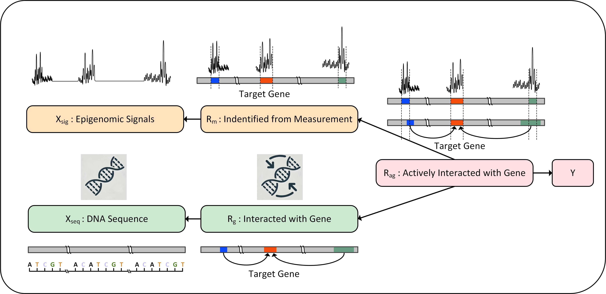

# Seq2Exp

This is the official implement of Paper [Learning to Discover Regulatory Elements for Gene Expression Prediction](https://arxiv.org/abs/2502.13991). You can also find our paper on [huggingface](https://huggingface.co/papers/2502.13991).



## Installation

- clone this repo
- create the env and install the requirements
  
```bash
git clone https://github.com/divelab/AIRS.git
cd AIRS/OpenBio/Seq2Exp
source ./install.sh
```

# Dataset

The dataset for this repo can be downloaded from https://huggingface.co/datasets/xingyusu/GeneExp. 
Set the dataset directory as `$DATA_ROOT` before running any experiments.

# Training and Evaluation

To reproduce the results of Seq2Exp, run the following
```bash
sh Seq2Exp.sh $DATA_ROOT
```

To reproduce the results of different baselines, run the following
```bash
sh baselines.sh $DATA_ROOT
```

# Evaluation by Trained Models

The pretrained model can be downloaded from https://huggingface.co/xingyusu/GeneExp_Seq2Exp. 
Set the target model path (`.ckpt` file) as `$MODEL_PATH`.

To evaluate based on a trained model, append the following parameters to the model training command inside the above `Seq2Exp.sh` file
```bash
train.only_test=True \
train.only_test_model_path=$MODEL_PATH
```

## Citation


Please cite our paper if you find our paper useful.

```
@article{su2025learning,
  title={Learning to Discover Regulatory Elements for Gene Expression Prediction},
  author={Su, Xingyu and Yu, Haiyang and Zhi, Degui and Ji, Shuiwang},
  journal={arXiv preprint arXiv:2502.13991},
  year={2025}
}
```

## Acknowledgments

This work was supported in part by the National Institute on Aging of the National Institutes of Health under Award Number U01AG070112 and ARPA-H under Award Number 1AY1AX000053. The content is solely the responsibility of the authors and does not necessarily represent the official views of the funding agencies.
