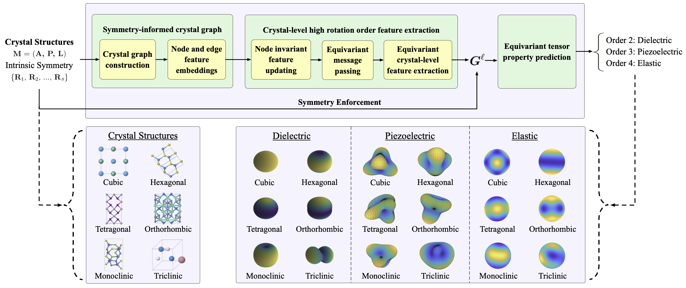

# A Space Group Symmetry Informed Network for O(3) Equivariant Crystal Tensor Prediction


[[OpenReview](https://openreview.net/forum?id=BOFjRnJ9mX)] [[arXiv](https://arxiv.org/abs/2406.12888)] [[Code](https://github.com/divelab/AIRS)]

The official implementation of A Space Group Symmetry Informed Network for O(3) Equivariant Crystal Tensor Prediction (ICML 2024).



## Dataset

### Dielectric, Piezoelectric, Elasticity

In our research, a dataset is curated specifically focusing on crystal tensor properties, including dielectric, piezoelectric, and elastic tensors, sourced from the JARVIS-DFT database. This dataset has been constructed with a keen emphasis on ensuring congruence between the properties and structures, achieved by extracting both the tensor property values and corresponding crystal structures directly from the DFT calculation files. This approach guarantees that the symmetry of the properties aligns with that of the structures. Notably, each tensor property within this dataset is computed using a consistent DFT core, ensuring uniformity in the calculation method.


## Enviroment: necessary packages to install
pytorch, pytorch_geometric, pymatgen, jarvis, wandb, e3nn, pandas, spglib, tqdm

## Training

```bash
python train.py 
```

Experimental code for piezo and elastic tensors in GMTNet_elast and GMTNet_piezo folders is not cleaned thoroughly, please use with caution. The dataset for dielectric and piezoelctric is released in the /data folder, and the dataset for elastic will be released soon.

## Citation
Please cite our paper if you find the code helpful or if you want to use the benchmark results. Thank you!
```
@inproceedings{yanspace,
  title={A Space Group Symmetry Informed Network for O (3) Equivariant Crystal Tensor Prediction},
  author={Yan, Keqiang and Saxton, Alexandra and Qian, Xiaofeng and Qian, Xiaoning and Ji, Shuiwang},
  booktitle={Forty-first International Conference on Machine Learning}
}
```

## Acknowledgement

We thank Tian Xie, Chenru Duan, Yuanqi Du, Haiyang Yu, and Youzhi Luo for insightful discussions. X.F.Q. acknowledges partial support from National Science Foundation under awards CMMI-2226908 and DMR-2103842. X.N.Q. acknowledges partial support from National Science Foundation under awards DMR-2119103 and IIS-2212419.
S.J. acknowledges partial support from National Science Foundation under awards IIS-2243850 and CNS-2328395.

## Contact

If you have any question, please contact me at keqiangyan@tamu.edu.
