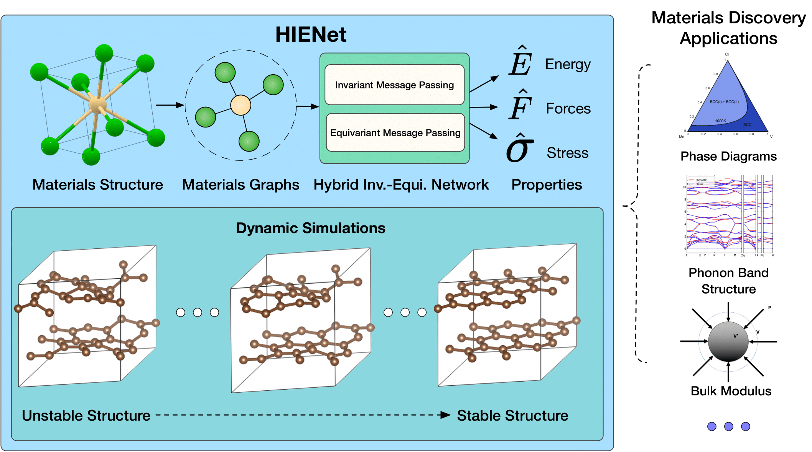

# A Materials Foundation Model via Hybrid Invariant-Equivariant Architectures

[[preprint](https://arxiv.org/abs/2503.05771)]

The official implementation for the HIENet model from our preprint "A Materials Foundation Model via Hybrid Invariant-Equivariant Architectures"



## Tutorial

TODO: Add directions on how to use model

## Citation

Please cite our preprint if you use our model or benchmark results. Thank you!
```
@misc{yan2025materialsfoundationmodelhybrid,
      title={A Materials Foundation Model via Hybrid Invariant-Equivariant Architectures}, 
      author={Keqiang Yan and Montgomery Bohde and Andrii Kryvenko and Ziyu Xiang and Kaiji Zhao and Siya Zhu and Saagar Kolachina and Doğuhan Sarıtürk and Jianwen Xie and Raymundo Arroyave and Xiaoning Qian and Xiaofeng Qian and Shuiwang Ji},
      year={2025},
      eprint={2503.05771},
      archivePrefix={arXiv},
      primaryClass={cs.LG},
      url={https://arxiv.org/abs/2503.05771}, 
}
```

## Acknowledgement

K.Y., M.B., A.K. and S.J. acknowledge partial support from
National Science Foundation (NSF) under grant IIS-2243850,
ARPA-H under grant 1AY1AX000053, and National Institutes of Health under grant U01AG070112. K.Z., S.K. and X.F.Q. acknowledge partial support from NSF under awards CMMI-2226908 and DMR-2103842 and the donors of ACS Petroleum Research Fund under Grant 65502-ND10. R.A. and D.S. acknowledge support from ARO through Grant No. W911NF-22-2-0117. R.A., X.N.Q. and S.Z. acknowledge NSF through Grant No. 2119103 (DMREF). Z. X. and X.N.Q. acknowledge support from NSF through grants SHF-2215573 and IIS-2212419. Some computations were carried out at the Texas A&M High-Performance Research Computing (HPRC) facility. We gratefully acknowledge the support of Lambda Inc. for providing computing resources.

## Contact

If you have any question, please contact keqiangyan@tamu.edu.
